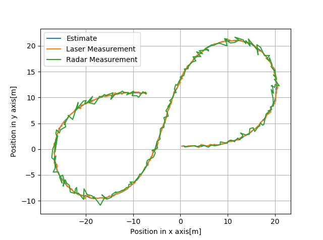

# Output Logging
The main.cpp is modified a little from the starter code with regard to data logging. The program writes the extimated values to a log file named "obj_pose-laser-radar-output.txt". The python file "Visualize-UKF.py" imports the data from the log file and visualizes the data. The visualization result shows how well the unscented kalman filter works with the use of Constant Velocity and Turn Rate(CRTV) model. 

## Position Estimate

The following figure shows the estimated position of the bicycle by the UKF and the measured position using the radar and laser sensors. The UKF tracks the bicycle accurately and smoothens the measurement data which is the prime objective of the algorithm.

