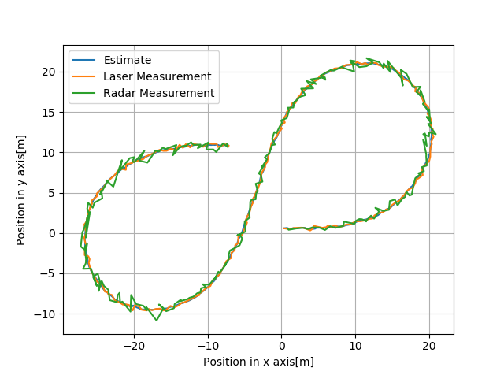

# Output Logging
The main.cpp is modified a little from the starter code with regard to data logging. The program writes the extimated values to a log file named "obj_pose-laser-radar-output.txt". The python file "Visualize-UKF.py" imports the data from the log file and visualizes the data. The visualization result shows how well the unscented kalman filter works with the use of Constant Velocity and Turn Rate(CRTV) model. 

## Estimated Values

The following figure shows the estimated position of the bicycle by the UKF and the measured position using the radar and laser sensors. The UKF tracks the bicycle accurately and smoothens the measurement data which is the prime objective of the algorithm.

The figure below shows the estimated bicycle position and the ground truth. It can be seen that the estimated postion by UKF is very accurate.

The next figures below shows the estimated velocities, yaw and yaw rate of the bicycle against the ground truth values. Even with only the velocity measurement from radar and no measurements for yaw and yaw rate the UKF algorithm with CRTV model is able to estimate the objects velocities and the oreintation fairly accurate. This makes this algorithm very powerful for tracking objects around autonomous vehicle.
### Velocity of the object along X axis

### Velocity of the object along Y axis

### Orientation of the object - Yaw angle

### Orientation of the object - Yaw Rate

## Root Mean Square Values

The following figures show the root mean square error values of the objects position and velocity along X and Y axes. The UKF algorithm converges very quickly. The RMSE values for the position reduces below 0.1 in 10 filter iterations approximately. The final RMSE values are below 0.09, so the UKF is very accurate. For the velocity estimations it takes longer time to converge which is mainly because only the radar sensor measures the velocity directly. Nevertheless the final values of the velocity are below 0.35.

### RMSE of Position Estimation 

### RMSE of Velocity Estimation

## Normalized Innovation Square

The program also calculates the Normalized Estimation Square values for the Radar measurements. For a random  process of chi square distribution of a system with 3 degrees of freedom about 5% of the NIS values lie below the value 7.815(taken from the chi square table). The figure below shows the NIS values and it can be seen that the NIS values fall below the 5% line most of the time which suggests that the chosen parameters are consistant.

